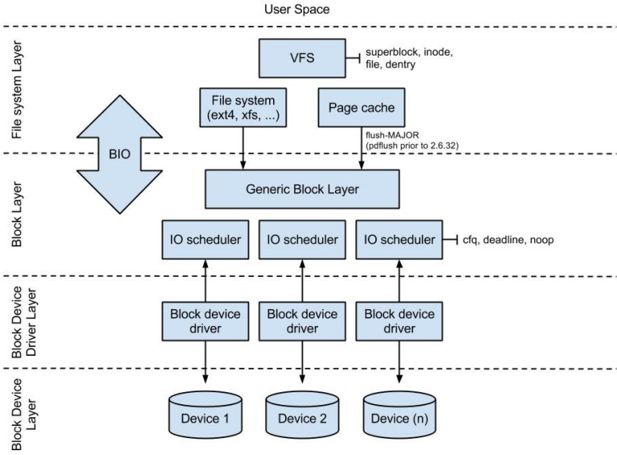

# IO Metrics

You will need 2 ssh terminals

## IO Usage

### Recall: Linux IO, Merges, IOPS

Linux IO performance is affected by many factors, including your application workload, choice of file-system, IO scheduler choice (eg. [cfq](https://www.kernel.org/doc/Documentation/block/cfq-iosched.txt), [deadline](https://www.kernel.org/doc/Documentation/block/deadline-iosched.txt)), queue configuration, device driver, underlying device(s) caches and more.



#### Merged Reads/Writes

From [the Kernel Documentation](https://www.kernel.org/doc/Documentation/iostats.txt): *"Reads and writes which are adjacent to each other may be merged for efficiency.  Thus two 4K reads may become one 8K read before it is ultimately handed to the disk, and so it will be counted (and queued) as only one I/O"*

#### IOPS

IOPS are input/output operations per second. Some operations take longer than others, eg. HDDs can do sequential reading operations much faster than random writing operations. Here are some rough estimations from [Wikipedia](https://en.wikipedia.org/wiki/IOPS) and [Amazon EBS Product Details](http://aws.amazon.com/ebs/details/):

| Device/Type           | IOPS      |
|-----------------------|-----------|
| 7.2k-10k RPM SATA HDD | 75-150    |
| 10k-15k RPM SAS HDD   | 140-210   |
| SATA SSD              | 1k-120k   |
| AWS EC2 gp2           | up to 10k |
| AWS EC2 io1           | up to 20k |

### Task I1: IO Usage

1. Start by running `iostat`, and examine the output fields. Let's go over the important ones together:
   ```bash
   (term 1) root:~# iostat -xd 2
   ```
	- **rrqm/s** & **wrqm/s**- Number of read/write requests merged per-second.
	- **r/s** & **w/s**- Read/Write requests (after merges) per-second. Their sum is the **IOPS**!
	- **rkB/s** & **wkB/s**- Number of kB read/written per-second, ie. **IO throughput**.
	- **avgqu-sz**- Average requests queue size for this device. Check out `/sys/block/<device>/queue/nr_requests` for the maximum queue size.
	- **r_await**, **w_await**, **await**- The average time (in ms.) for read/write/both requests to be served, including time spent in the queue, ie. **IO latency**
2. Please write down these field's values when our system is at rest.
3. In a new session, let's benchmark our device *write performance* by running:

	```bash
	(term 2) root:~# /bin/sh linux-metrics/scripts/disk/fio1.sh
	```
	
	This will clone 16 processes to perform non-buffered (direct) random writes for 3 minutes.
	1. Compare the values you see in `iostat` to the values you wrote down earlier. Do they make sense?
	2. Look at `fio` results and try to see if the number of IOPS make sense (we are using EBS gp2 volumes).
4. Repeat the previous task, this time benchmark **read performance**:

	```bash
	(term 2) root:~# /bin/sh linux-metrics/scripts/disk/fio2.sh
	```
	
5. Finally, repeat **read performance** benchmark with 1 process:

	```bash
	(term 2) root:~# /bin/sh linux-metrics/scripts/disk/fio3.sh
	```
	1. Read about the `svctm` field in `man 1 iostat`. Compare the value we got now to the value we got for 16 processes. Is there a difference? If so, why?
	2. Repeat the previous question for the `%util` field.

6. `fio` also supports other IO patterns (by changing the `--rw=` parameter), including:
	- `read` Sequential reads
	- `write` Sequential writes
	- `rw` Mixed sequential reads and writes
	- `randrw` Mixed random reads and writes

	If time permits, explore these IO patterns to learn more about EBS gp2's performance under different workloads.

### Discussion

- Why do we need an IO queue? What does it enable the kernel to perform? Read a few more things on IO queue depths [here](https://blog.docbert.org/queue-depth-iops-and-latency/)
- Why are the `svctm` and `%util` iostat fields essentially useless in a modern environment? (read [Marc Brooker's excellent blog post](https://brooker.co.za/blog/2014/07/04/iostat-pct.html))
- What is the difference in how the kernel handles reads and writes? How does that effect metrics and application behaviour?

### Tools

 - Most tools use `/proc/diskstats` to fetch global IO statistics.
 - Per-process IO statistics are usually fetched from `/proc/[pid]/io`, which is documented in `man 5 proc`.
 - From the command-line you can use:
	 - `iostat -xd <delay> <count>` for per-device information
		 - `-d` device utilization
		 - `-x` extended statistics
	 - `sudo iotop` for a `top`-like interface (easily find the process doing most reads/writes)
		 - `-o` only show processes or threads actually doing I/O

#### Next: [Network Utilization](net-util.md)
